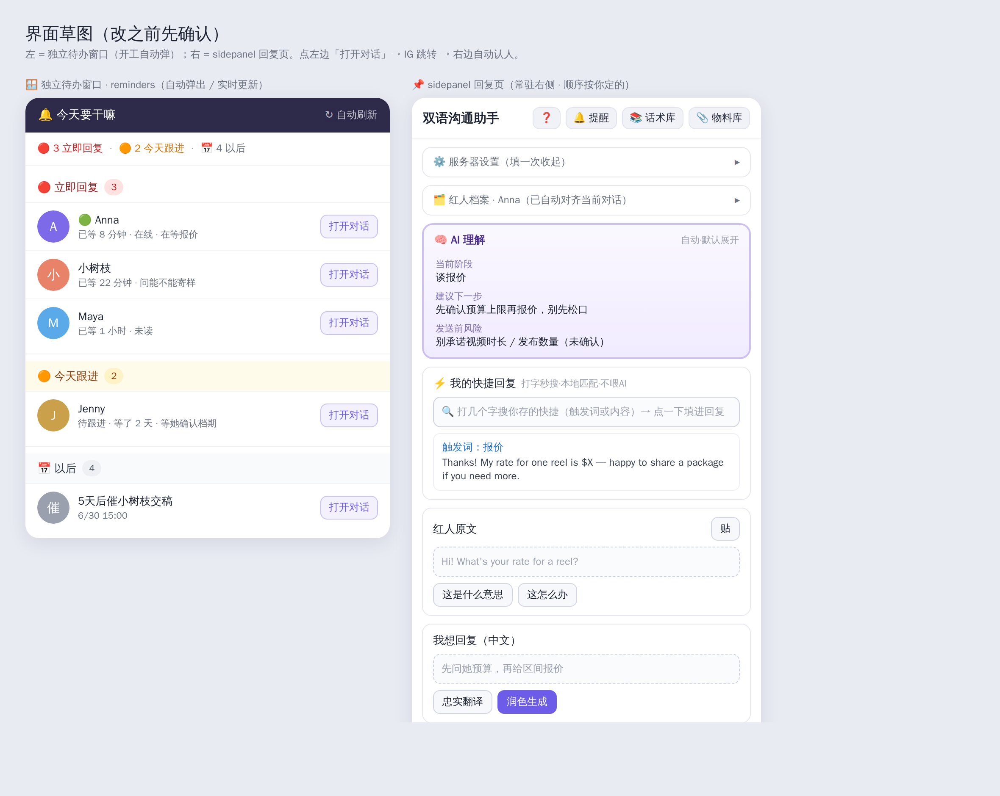

# 按钮逻辑清单（改版施工图 · 第 2 稿）

> 「先理逻辑、再改代码」的施工图。每个按钮写清：**在哪 / 点了干嘛 / 数据哪来 / 调不调 AI / 结果显示哪**。
> 标记：🆕 新增　✏️ 改　❌ 删　✅ 不变
> **审阅方式**：对的打勾，错的直接在那条下面写「改成 XX」。全部定稿后才动代码。
>
> **本稿已采纳的决定**：① 今天跟进＝当天解决（无 AI 天数阈值）；② AI 理解有缓存先显示、变化才重算；③ 待办窗口每次开浏览器都弹；④ **版本号先不升**。
>
> 📐 **界面草图**：`docs/界面草图.png`（源码 `docs/界面草图.html`）。左＝独立待办窗口，右＝回复页 7 区块。

---

## 总览：三个面

| 面 | 是什么 | 跑在哪 |
|---|---|---|
| **独立待办窗口** | 开工自动弹，今天要干嘛清单 | `reminders.html` |
| **sidepanel 回复页** | 常驻右侧，回复单个红人 | `sidepanel.html` 主区 |
| **后台采集**（看不见） | 开对话自动采 → 最新进度 | `content.js` + `kol-reminder.js` |

---

## 一、顶部常驻栏

| 按钮 | 标记 | 点了干嘛 | 数据 / AI |
|---|---|---|---|
| ❓ 指引 | ✏️ | 展开/收起指引（文案要重写成新结构） | 无 |
| 🔔 提醒 | ✏️ | 展开 `#reminder-panel`（已简化成「加待办 + 打开完整清单」，不再平铺列表，详见一b） | `kolThreads`/`kolTodos` |
| 📚 话术库 | ✏️ | 打开话术库面板（**已有话术 + 上传 都在里面**） | `/api/playbook`+`/api/knowledge` |
| 📎 物料库 | ✏️ | 打开物料库面板（**已有物料 + 上传 都在里面**） | `/api/assets` |
| ~~📥 上传话术~~ | ❌ | **删掉独立按钮**（上传并进话术库面板内） | — |
| 状态灯 | ✅ | 点一下重测服务 | `/health` |

---

## 一b、🔔 提醒面板（`#reminder-panel`，侧边栏内，点顶部 🔔 展开）✏️ 已简化

> 旧版这里平铺整个提醒列表；现在**只剩「加待办 + 打开完整清单」**，真正看待办去独立窗口（§三）。

| 控件 | id | 标记 | 点了干嘛 | 数据 / AI |
|---|---|---|---|---|
| 一句话输入框 | `todo-smart` | 🆕 | 打一句话（例「5天后小树枝交稿 / 明天下午3点催 @Anna」） | — |
| 🪄 智能加 | `add-todo-smart` | 🆕 | 调 `/api/parse-todo` 解析出**事项 + 时间** → 拼 `dueAt` 存进 `kolTodos`。**自动关联当前打开的红人对话**：取 `getActiveConversation()` 的 `tid` 写进待办 `threadId`（之后该待办卡能「一键打开对话」），按钮显示「已加 ✓ 关联XX」 | **调 AI** `/api/parse-todo` |
| 关联引导区 | `todo-link-hint` | 🆕 | **没自动绑上红人时才出**（`showTodoLinkHint`）：提示「想让这条待办能一键打开对话？填红人名字关联（选填）」 | 本地 |
| └ 名字输入 + 🔗 关联 | `.tlh-input` / `.tlh-link` | 🆕 | 填红人名字 → `matchThreadByName()` 在 `kolThreads` 里按名字匹配 → 命中则把 `threadId` 补绑到这条待办（`linkTodoThread`）；没找到提示去 IG 先聊一次 | 本地匹配，不调 AI |
| 或手动填（折叠 `todo-manual`） | — | ✅ | 事项 `todo-text` + 时间 `todo-due`(datetime-local) | — |
| ＋ 加待办 | `add-todo` | ✅ | 手动存一条进 `kolTodos`（不解析、不绑 threadId） | — |
| 🪟 打开完整待办清单（新窗口） | `open-todo-window` | ✅ | 发 `KOL_OPEN_TODO_WINDOW` → 弹独立窗口（§三） | — |
| 收起 | `reminder-close` | ✅ | 关面板 | — |

---

## 二、⚙️ 服务器设置（折叠，填一次收起 · 配置唯一入口）

> 身份（ins id / 产品 / 员工名）只在这里填——**没有独立「身份设置」表单**。
> ins id 同时当提醒里「我自己的号」，产品同时当「我负责的产品」（保存时写进 `kolReminderSettings`，见 `syncReminderIdentity()`）。
> 没填 ins id / 产品时顶部出橙色软提示横幅 `#setup-banner`（不锁按钮，「去填写」展开本设置）。

| 控件 | id | 标记 | 说明 |
|---|---|---|---|
| 服务地址 | `server-address` | ✅ | API_BASE，默认 VPS IP；本机调试改 `http://127.0.0.1:3210` |
| 团队口令 | `server-token` | ✅ | 设了之后所有 `/api/*` 带 `X-KOL-Token`（本机单人可留空） |
| 管理员口令 | `server-admin` | ✅ | 填了才能编辑/删除话术、落库导入团队库（留空＝普通成员） |
| 你的 Instagram ID | `server-insid` | ✅ | =你的身份：云端自动备份 key + 提醒认「我方号」 |
| 你的名字（员工名） | `server-staffname` | 🆕 | 管理后台显示「谁对接的」，防换号/换人 |
| 你负责的产品 | `product` | ✅ | 生成话术默认用它（同时＝提醒里「我负责的产品」） |
| 💾 保存并连接 | `save-server` | ✅ | 存设置 + 重测 + `syncReminderIdentity()` 同步提醒身份 |
| ☁️ 从云端恢复 | `cloud-restore` | ✅ | 换电脑填同 ins id 恢复（改动后防抖 2.5s 自动云备份，平时无需手点） |
| ~~💾 导出文件 / 📂 导入文件~~ | — | ❌ | **已删**（没人用离线导入导出；云备份已够） |

> 说明：自动识别我方号——`kol-reminder.js` 的 `maybeAutodetectHandle()` 没填 ins id 时从 IG 导航栏头像链接自动认出我的号 + 推断产品；填了就不再覆盖。

---

## 三、独立待办窗口 `reminders.html` ✏️ 重点改

**整体**：开工**自动弹出**（🆕，每次开浏览器都弹——红色天然含未读 + 已读不回，开机基本必有内容）；窗口内实时刷新（已回就走、对方再发又回）。顶部一个 `刷新` 按钮（`todo-window-refresh`，手动重渲染）。`computeItems` 算出全部项，按桶分组渲染。

**四个桶**（`reminders.js` `render()` 的 groups，无对应项的桶不渲染）
| 桶 | 进桶条件（`computeItems`） |
|---|---|
| 🔴 立即回复（含未读 + 已读不回） | `rec.needsReplyRaw` 且非寒暄 且未被「不用提醒」压制（`replyDismissedSig !== 判定签名`）；在线排最前、再按等最久降序 |
| 📤 该催对方（红人不回 · 逐级跟进） 🆕 | 我方已发、红人不回（`!needsReplyRaw && lastFollowUpAt`），满 **1 天**升一级：`followUpLevel+1` → 1=二次跟进 / 2=再跟进 / 3=最后通牒 / 4=建议终止；该级未被「这级不用提醒」压制（`followDismissedLevel`） |
| 🟠 今天跟进 | **今天到点（含已过期）的待办**（`dueAt <= 今天 23:59`）。✏️ 纯按日期，不用 AI 天数阈值 |
| 📅 以后 | 用户**自己选了未来日期**的待办 |

**每条卡片**（`card(it)`）
| 元素 | 标记 | 内容 / 来源 |
|---|---|---|
| 头像 | ✅ | `it.avatar`＝`thread.avatarUrl`（`no-referrer` 加载、失效自动移除），没有则首字母彩色圆。待办卡无头像 |
| 名字 / 标题 | ✅ | 红人卡＝`pickInboxTitle()`（待办卡前缀 `📝`、催场卡前缀 `📤`，待办标题＝待办文本） |
| 一行总结（红人卡必有，待办卡无） | ✅ | **「红人说到哪了 + 该干嘛」**，中文。三级回退：① 点进去过 → `kolSummaries` 真总结；② 没点进去过的待回复 → `autoSummary`（AI 把预览归纳成一句中文）；③ 都没有 → **留空不显示那行**（绝不贴外语原文、不放占位） |
| meta 行（提醒原因） | ✅ | 红人卡：`未读/已读未回 + 已等 X分钟/天 + 🟢在线`（锚点 `lastCreatorMessageAt`）；催场卡：`已等 X 天没回 · 该XX`；待办卡：`到点：M/D HH:MM` 或未来日期 |

**每条卡片的按钮**（按 kind 不同）
| 卡片 kind | 按钮 | 点了干嘛 | 数据 / AI |
|---|---|---|---|
| 红人 / 催场（`reply`/`followup`） | 打开对话 | 永远有。三级兜底：`threadId` 深链跳 IG → 无深链则发 `KOL_OPEN_THREAD_BY_NAME` 让内容脚本按名字点开 → 都失败退收件箱首页 | `openConversation()`，不调 AI |
| 待办（`today`/`future`） | 打开对话 | **只有带 `threadId` 时才出**（智能加时绑了当前对话才有）；没 threadId 就不显示这个按钮 | 同上 |
| 红人（`reply`） | 不用提醒了 | 压制本条（`replyDismissedSig = 判定签名`），下次同签名不再提醒 | 本地写 `kolThreads` |
| 催场（`followup`，level<4） | ✍️ 生成{二次跟进/再跟进/最后通牒}话术 🆕 | 调 `/api/followup` 出**催场话术**（四级升级框架，日语走 見送り 礼貌框架）；返回 `reply_target`(外语)+`reply_chinese`(中文)，就地渲染草稿框 + 「📋 复制话术」按钮；可重新生成。**level=4「建议终止」不给生成按钮** | **调 AI** `/api/followup` |
| 催场（`followup`） | 这级不用提醒 🆕 | 压制当前级别（`followDismissedLevel = level`），升到下一级才再提醒 | 本地写 `kolThreads` |
| 待办（`today`/`future`） | 完成 / 删除 | `done:true` / `dismissed:true` | 本地写 `kolTodos` |
| 群聊（`isGroup`） | 🔕 这个群别再提醒 | `muted:true`，整条对话永久静音 | 本地写 `kolThreads` |

> 监听：`storage.onChanged` 听 `kolThreads`/`kolTodos`/`kolSummaries`（真总结常单独写，漏听不刷新）。

---

## 四、sidepanel 回复页（顺序 = 你定的）

> ❌ 删顶部三 tab（红人来消息 / 我主动发 / 问 AI），回复页只一个。
> ❌ 删整块「我主动发」`panel-proactive`、「问 AI」`panel-chat` 及其全部 JS。
> ❌ 删「📋 合作进展存档」面板（手动📸抓取这屏整套）。

### 4-1　🗂️ 红人档案（第 1 位，折叠）✏️ 上移到最顶，内容不变
包含：App User ID／合同信息（法定名称、合同寄送邮箱、完整付款信息）／备注。
| 按钮 | 标记 | 说明 |
|---|---|---|
| 自动对齐 | ✅ | 打开对话时按当前 IG 对话名自动匹配 |
| 查 / 💾 保存 / 🗑️ 删除 | ✅ | 查/存/删该红人档案（`kolProfiles` 本地） |

### 4-2　🧠 AI 理解（第 2 位）🆕 全新置顶块
| 元素 | 标记 | 说明 |
|---|---|---|
| 触发 | 🆕 | 打开对话后自动跑；**有缓存先显示、内容变了才重算**（省 token） |
| 默认展开 / 可折叠 | 🆕 | — |
| 当前阶段 / 建议下一步 / 发送前风险 | 🆕 | 来自 `/api/analyze` |
| ~~紫色「禁止外发」徽标~~ | ❌ | **删** |
| ~~复制按钮~~ | ❌ | **删** |

### 4-3　⚡ 我的快捷回复（第 3 位，折叠）✅ 不变
搜索框本地秒匹配 `kolQuickReplies`（不喂 AI）；点一条填进回复；＋手动加。

### 4-4　红人原文（第 4 位）✅ **完全沿用现有实现，不动**
现有 input-card 第一框（`message`）。按钮「这是什么意思 / 这怎么办」走 `/api/ask`，行为不变。

### 4-5　我想回复（中文）（第 5 位）✅ **完全沿用现有实现，不动**
现有 input-card 第二框（`reply-intent`）+「忠实翻译 / 润色生成 / 回复语言下拉 / 从话术库选话术」，全部按现状，不改逻辑。

### 4-6　✅ 双语回复（A·可发）（第 6 位）✏️ 删两样
| 按钮 | 标记 | 说明 |
|---|---|---|
| 左右分屏 / 选句高亮 / 复制全部 / 单句复制 | ✅ | 不变 |
| ✅ 按修改后的中文改写外语（`rewrite-from-zh`） | ✅ | `/api/rewrite` |
| ⭐ 存为快捷 / 保存为话术 | ✅ | 搬进个人快捷 / 存团队话术 |
| ~~识别 & 内部提醒（analysis-block 折叠块）~~ | ❌ | **全删，不用了** |
| ~~保存为确认话术（save-scenario）~~ | ❌ | **删，没用** |

### 4-7　✍️ AI 改写（第 7 位，双语回复下面）✅ **沿用现有，不动**
独立的 `rewrite-card`：「或：写一句话让 AI 改（语气 / 长度 / 口径）」。
| 按钮 | 标记 | 点了干嘛 | AI 接口 | 结果 |
|---|---|---|---|---|
| 让 AI 改 / 生成双语（`rewrite-go`） | ✅ | 写一句改写指令（太长了精简、语气更热情、别提价格…）→ AI 改 | `/api/rewrite`（有回复→refine；没回复→中译外） | 直接刷新上面的双语分屏 |

> 注：`/api/analyze` 只供 4-2 顶部 AI 理解用；底部那整块详细分析删掉。

---

## 五、话术库 / 物料库（各自面板内＝已有 + 上传，都在一个面板里）

| 面板 | 标记 | 里面有什么 |
|---|---|---|
| 📚 话术库 | ✏️ | ① 搜已有（playbook+knowledge 合并搜，每条「⭐ 存进快捷」）② **上传 Word**（选 .docx → 本地解析 → `/api/knowledge/import`，仅管理员） |
| 📎 物料库 | ✅ | ① 看已有物料 ② 上传物料（`/api/assets`） |

> 没有任何独立「上传」按钮，上传一律在对应面板内完成。

---

## 六、后台采集（看不见，不占界面）🆕

| 环节 | 标记 | 逻辑 |
|---|---|---|
| 开对话即采集 | 🆕 | 打开对话起自动捕捉当前屏；AI 自定节奏自动逐屏抓完整段 |
| 离开对话前总结 | 🆕 | 把这次（画面对话 + 红人最新消息）总结成「最新进度」，存 `kolSummaries` |
| ❌ 手动一屏一屏追加 | ❌ | 删旧 `grab()` |
| 喂两处 | 🆕 | 最新进度 → ① 待办每条总结　② 回复页 AI 理解底料 |

---

## 七、删除清单（汇总）

- ❌ 顶部三 tab + 「我主动发」`panel-proactive` + 「问 AI」`panel-chat`（含全部 JS）
- ❌ 「📋 合作进展存档」面板 + 手动📸抓取这屏 + 旧 `grab()`
- ❌ 顶部「📥 上传话术」独立按钮（并进话术库面板）
- ❌ 设置里「💾 导出 / 📂 导入」离线备份按钮
- ❌ AI 理解的紫色徽标 + 复制按钮
- ❌ 双语回复下的「识别&内部提醒」整块 + 「保存为确认话术」按钮
- ❌ 相关 JS：`generateFree` `rewriteGoPro` `translateProReply` `sendChat` `renderChat` `loadQuickTemplates` `generateQuickTemplate` `selectQuickTemplate` 等

---

## 已定的决定（不再是疑问）

1. ✅ 今天跟进 = 当天解决，无 AI 天数阈值；用户自己选未来日期才进「📅 以后」
2. ✅ AI 理解：有缓存先显示、内容变了才重算
3. ✅ 待办窗口：每次开浏览器都弹
4. ✅ 版本号：**先不升**
